```{r setup, include=FALSE}
knitr::opts_chunk$set(echo = FALSE)
```

# 1.0	 Original Data Visualisation
Singapore’s merchandise performance with its major trading partners in year 2020 was originally presented as follow:

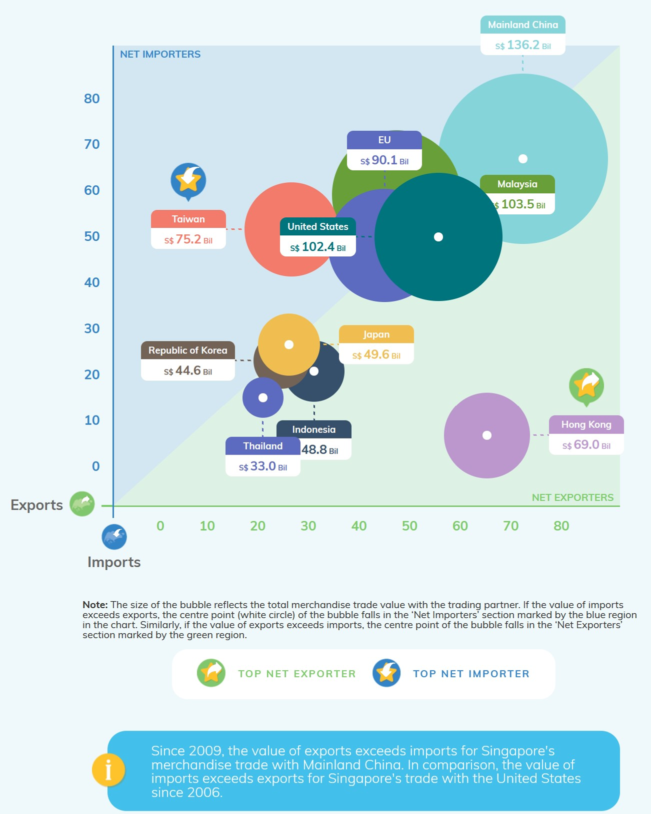
Figure 1: Original Visualisation


## 1.1 Clarity
It was observed that the clarity of the original visualisation had been diminished by the following shortcomings:

***(a)	Missing circle centres:*** The white-dotted centre for each circle served as the reference point for export value on the y-axis and import value on the x-axis. In addition, the author also highlighted the white-dotted centre demarked a country as “net importer” or “net exporter” if it falls within the corresponding areas on the graph. However, the white-dotted circle centres for a few trading partners i.e., EU, Republic of Korea, and Taiwan were covered by labels and other circles which made it impossible to identify the export/import values or the trade positions for these countries.  

***(b)	Missing graph title and legend:*** There was also no graph title and legends which would have helped to clarify the purpose of the graph as well as the use of circles and colours.

***(c)	Lack of markings and units on both x- and y-axes:*** There was no marking or units provided for the import values on the x-axis and export values on the y-axis, which makes it difficult to identify the import and export values of the countries shown.

## 1.2 Aesthetics

The original visualisation was also aesthetically challenged in the following ways:

***(a)	Inappropriate circle scale:*** The graph used circles to plot the magnitude of the country trade values for comparison. However, the scale of the circles did not commensurate with the size of the trade values because the circles enlarged disproportionately as trade values increased.
 
***(b)	Cluttered-looking graph:*** Labels on the total trade values, comprising the sum of import and export values, were provided for every single country shown. These added clutter to an already busy-looking graph with many coloured circles and could have been avoided if the author had made better use of the graph axes to demark the trade values. 

***(c)	Inappropriate use of colours:*** It is noted the trade values for Thailand and EU shared the same purple colour whilst a multitude of other different colours were used for the 8 other countries as well as graph areas. The use of colours could have been better managed to provide meaning to the graph, such as a consistent colour scheme to represent the differing sizes of the country trade values or to distinguish between net importers and net exporters.  However, a kaleidoscope of colours was provided instead with no explanation on their use.

# 2.0	 Alternative Graphical Presentation

The proposed alternative graphical presentation is as follow:

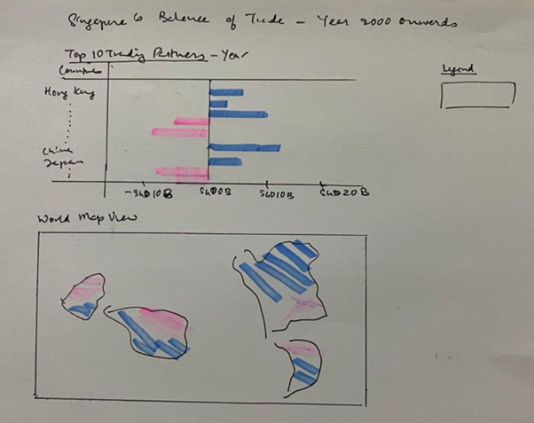 
Figure 2: Alternative Graphical Presentation

## 2.1 Clarity Improvements

The alternative graphical representation would enhance the clarity of the visualisation in the following ways:

***(a)	Change to world map view and bar chart with auto-scrolling option:*** Singapore’s balances of trade with its trading partners from year 2000 to 2020 have been plotted in synchronised bar chart and world map view, with selection option for auto-scrolling of the trade balances on year-by-year basis. As a result, the user would be able to interact with the visualisation to explore Singapore’s trading profiles with greater control and clarity. 

***(b)	Add graph header:*** A graph title “Singapore’s Balance of Trade – Year 2000 Onwards” has been added to bring to focus that the visualisation is to explore Singapore’s trading position with its major trading partners from year 2000 onwards.

***(c)	Correct labelling and formatting of x- and y-axes with legend:*** Titles, units, unit markings, and synchronised graph legend have been included in the visualisation to provide greater clarity for the user. 

## 2.2	 Aesthetical Improvements

The proposed visualisation will also provide the following aesthetical improvements:

***(a)	Remove circle overlays and clutter:*** The previous confusing overlay of circles embodying Singapore’s trade values in block colours are avoided in the proposed visualisation which provided a clear and uncluttered world map view of Singapore’s trade balances. The smaller supporting bar chart also harmonised and complemented the world map by bringing focus to Singapore’s top 10 trading partners.

***(b)	Highlight important trends through use of movement and colour:*** The auto-scrolling year-by-year profiles facilitated a clear and impactful visualisation of the Singapore’s evolving trade positions with its trading partners over the years.

***(c)	Simplify and synchronise graph colours to provide meaning:*** The map and chart colours are simplified to a consistent scheme of blue and red in its various shades to provide illustrate the differing trade volumes between Singapore and its trading partners. The simple colour scheme avoided distracting from the visualisation message, and helped to clarify and compare the different trading profiles.

# 3.0	 Proposed Visualisation

Please view the interactive visualisation on Tableau Public [**here**](https://public.tableau.com/app/profile/jessica.tan2849/viz/DataViz2_16239512887800/Dashboard1).


# 4.0	 Step-by-step Procedure Guide

## 4.1 Data setup & preparation

•	Create a new workbook and click ‘Connect to data’:

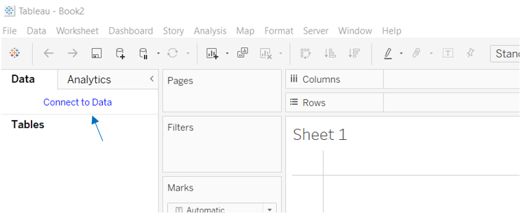  
Figure 4.1.1: Connect to Data

•	Open and load excel file (i.e., outputFile) into Tableau in Datasource template:

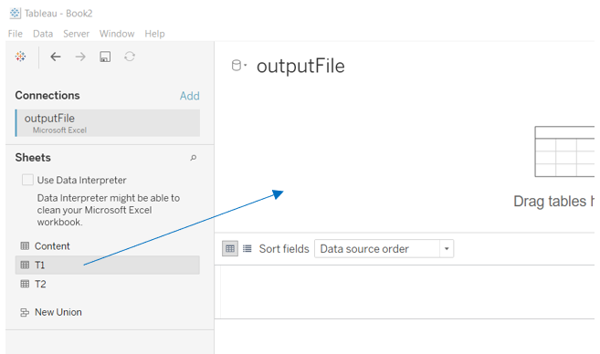  
Figure 4.1.2: Load file

•	Join T1 (“Imports”) and T2 (“Exports”) tables by linking up the common “Variables” column:

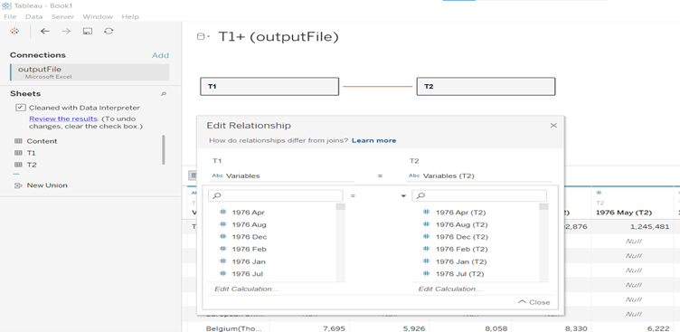   
Figure 4.1.3: Join T1 and T2 tables

### [Note: From here onwards, the following steps are applicable for both T1 and T2.]

•	Clean the files using the “Data Interpreter”. As a result, all previous “na” values are transformed to “null”: 

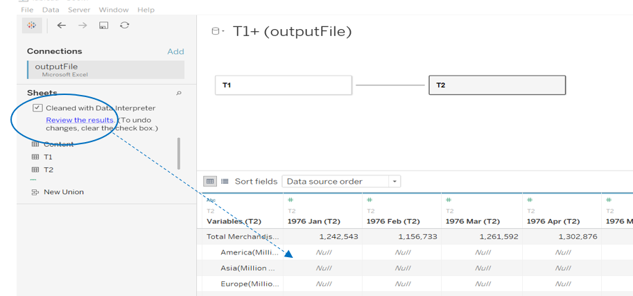   
Figure 4.1.4: Cleaned file

•	Exclude by “hiding” month-year columns from years 1976 to 1999 as these years are not included in the visualisation timeline:

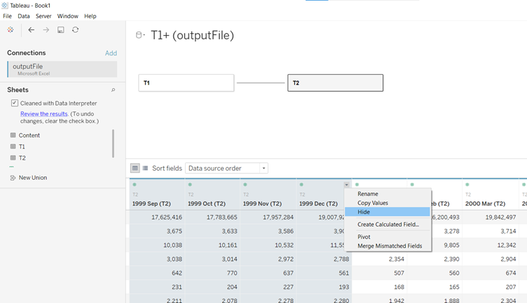   
Figure 4.1.5: Hide irrelevant columns

•	Apply “pivot table” function on the remaining month-year columns from Jan 2000 onwards to transpose the month-year data into a single column for visualisation processing:

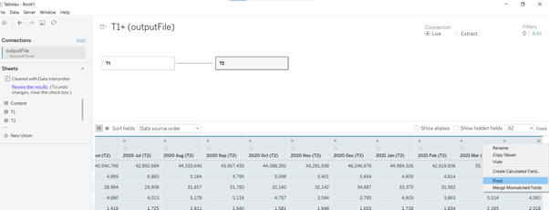   
Figure 4.1.6: Apply “pivot table” function to transpose month-year columns 

•	Rename the transposed month-year column into “Date”, and format the data-type of the column accordingly:

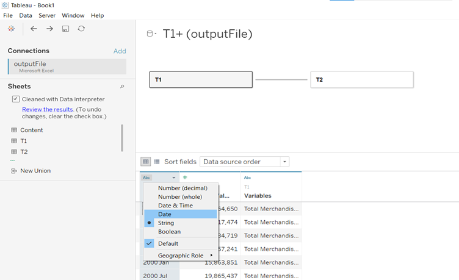   
Figure 4.1.7: Name and format “Month-Year” column as “Date”

•	For the “Variables” column, split the column to separate the country names from trade value units:

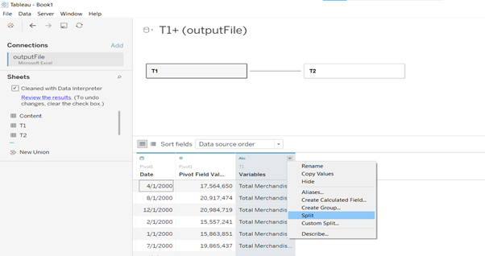   
Figure 4.1.8: Split ”Variables” column into country names and trade value units

•	Thereafter, “hide” the “Variables” and “Variables-Split2” columns as these columns would not be used for the visualisation:

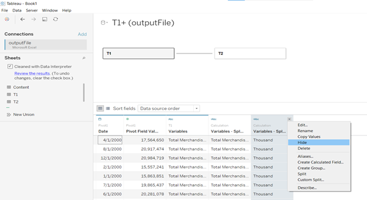  
Figure 4.1.9: Exclude “Variables” and “Variables-Split2” columns

•	Rename the remaining “Variables-Split1” column as “Countries” since this contains the country names:

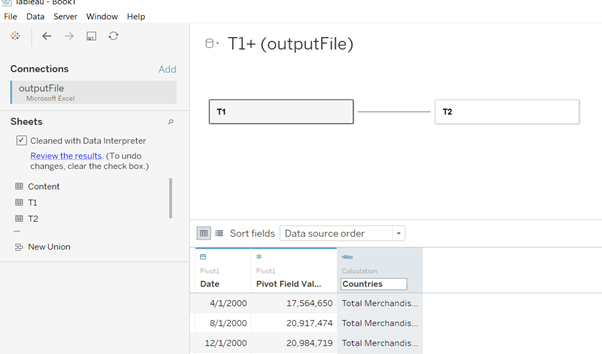  
Figure 4.1.10: Rename “Variables-Split1” column as “Countries” 

•	Format the data type of “Countries” to “Geographical Role” of “Country/Region”:

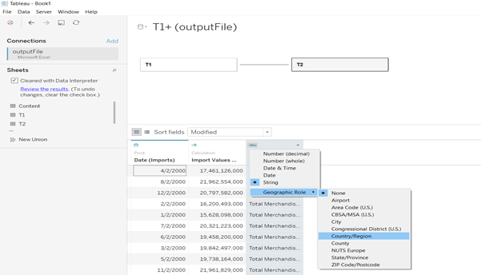   
Figure 4.1.11: Format “Countries” column to “geographical role” 

•	The raw trade values column is denoted in SGD thousands. To facilitate conversion to SGD Billions in subsequent part of this visualisation procedure, the trade values are first converted to base SGD unit (from thousands) using “Analysis-Calculated Field” function. Thereafter, the column is named as “Trade Values (SGD)”: 

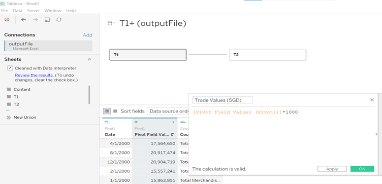    
Figure 4.1.12: Transform trade values column from SGD thousands to SGD units

•	Thereafter, tables T1 and T2 are renamed to “Imports” and “Exports”:

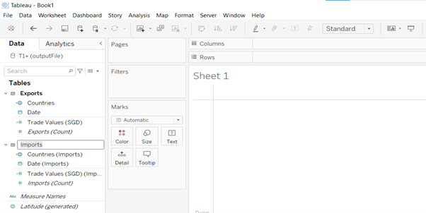   
Figure 4.1.13: T1 and T2 tables are renamed as “Imports” and “Exports”

## 4.2 Visualisation Re-design

### 4.2.1 World Map View by Year

•	Drop “Countries” into the chart area, and the world map view of the trade data will emerge as follow:

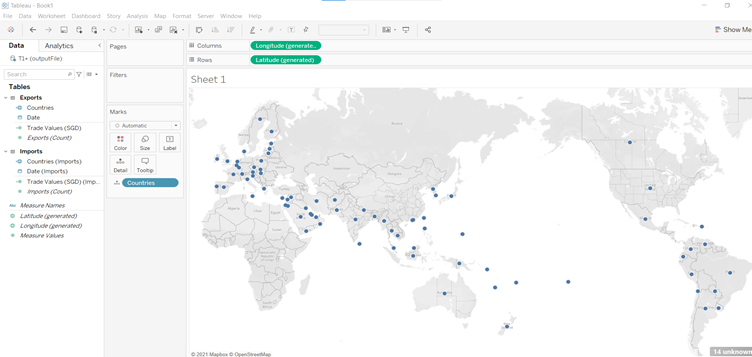   
Figure 4.2.1: Input “Countries” into chart area

•	Create calculated field “Trade Balance” to derive the difference between Export values (represented by column “Trade Values”) and Import values (represented by column “Trade Values (Imports)”):

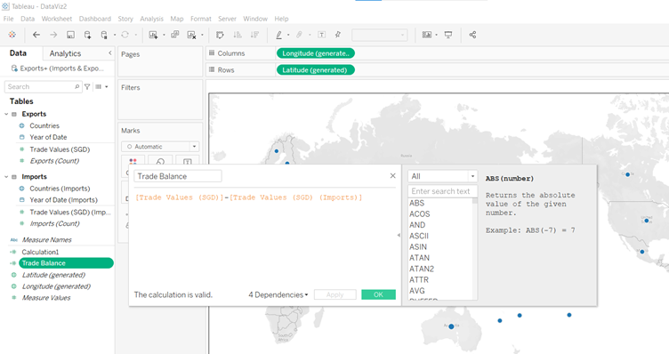   
Figure 4.2.2: Created calculated field “Trade Balance” 

•	Thereafter, input “Trade Balance” into “Marks-Colour” field and the world map will be coloured for the countries where Singapore has a trade balance:

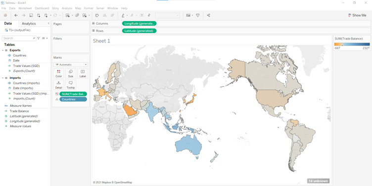   
Figure 4.2.3: Input “Trade Balance” into “Marks-Colour” field 


•	Thereafter, click on the legend to edit colours by choosing a colour scheme as well as tick “Stepped Colour 6 Steps” to provide granularity of colours to the trade balances shown on the world map:

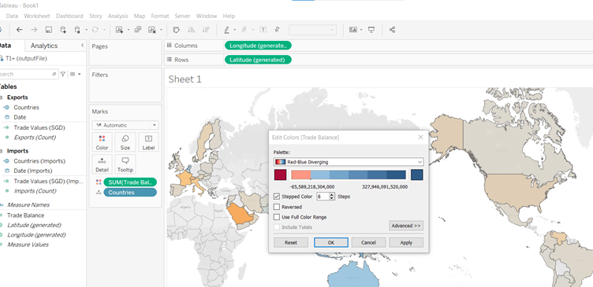   
Figure 4.2.4: Choose map colour scheme

•	Next, bring “Countries” to “Filters” field to exclude regions (i.e., Africa, America, Asia, Europe, European Union, Oceania, Total Merchandise) as the countries in these regions are already included in the data:

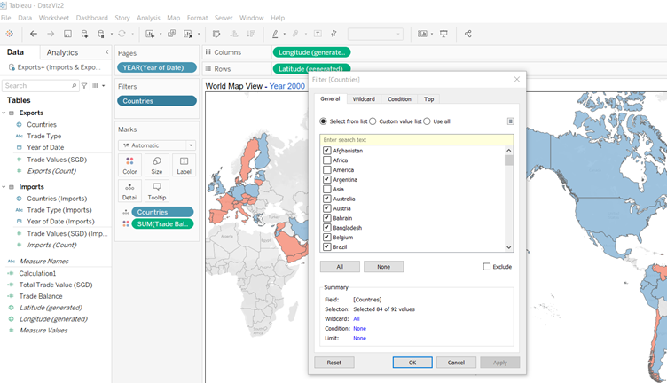  
Figure 4.2.5: Remove regions from visualisation 

•	Thereafter, bring “Date” to “Pages” field to provide auto-scrolling option of Singapore’s trade profiles in the world map by year:

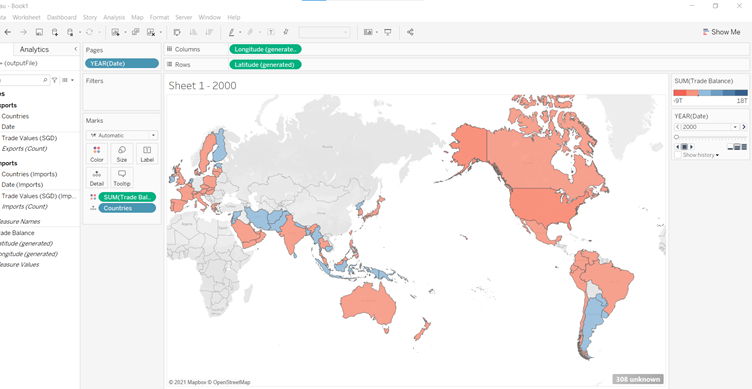   
Figure 4.2.6: Provide auto-viewing mode by year 

•	Format currency of “Trade Balance” into SGD Billions:

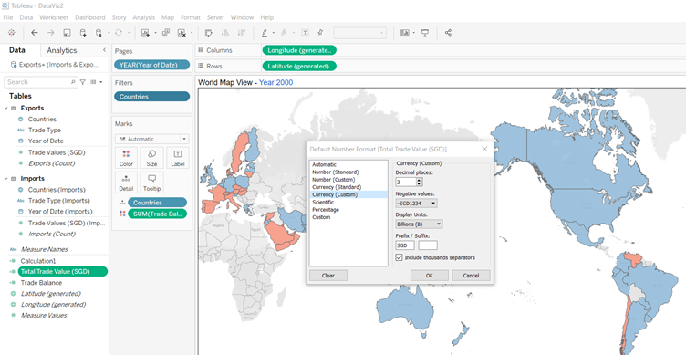   
Figure 4.2.7: Format currency of “Trade Balance” into SGD Billions

•	Insert map title “World Map View” with detail on <Page Name> which will show the year of map view according to the auto-viewing mode:

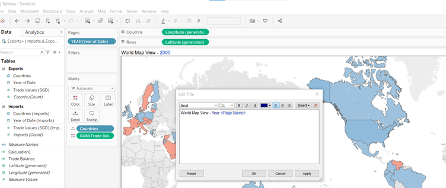   
Figure 4.2.8: Map title 

•	The completed world map view on Singapore’s trade profiles by year is as follow: 

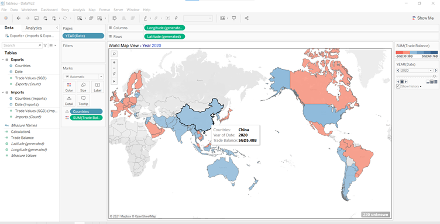   
Figure 4.2.9: Completed world map view

### 4.2.2 Bar Chart on Trade Balance with Top 10 Trade Partners

•	First, bring “Trade Balance” to both “Columns” and “Marks-Colour” fields, as well as “Countries” to “Rows” field: 

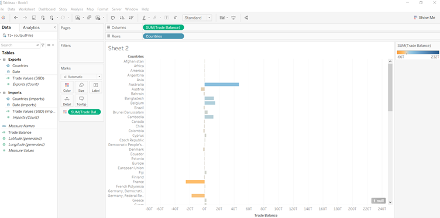   
Figure 4.2.10: Create bar chart 

•	Next, input “Date” into “Pages” field and “Countries” into “Filters” field. Then choose the 10 top trading partners in the selection view and close:
  
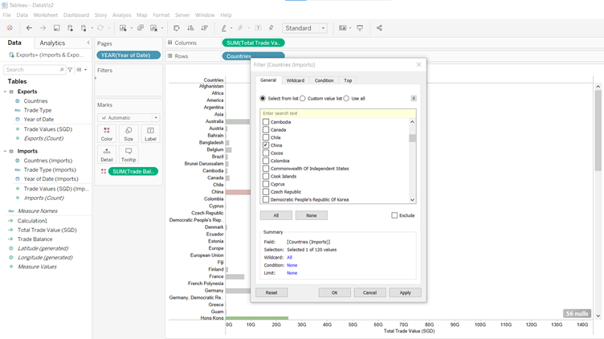    
Figure 4.2.11: Select top 10 trading partners  

•	Synchronise the colour scheme and granularity of the bar chart with the world map to ensure a co-ordinated look:

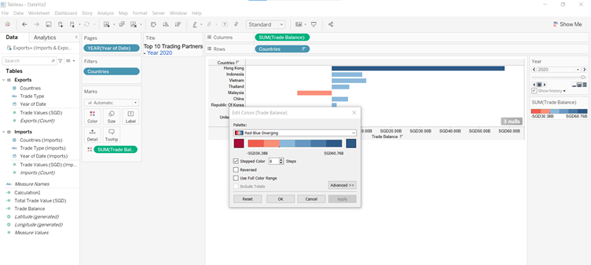   
Figure 4.2.12: Select synchronised colour scheme

•	Also input the graph title with <Page Name> detail. The latter would provide the specific year of the data shown, which is important for clarity when the trade profiles are scrolled via auto-viewing mode:

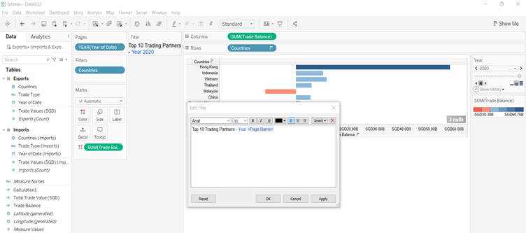   
Figure 4.2.13: Insert bar chart title

## 4.3 Dashboard Building

•	Input the bar graph and world map into the dashboard and adjust/align the 2 items for the best aesthetical effect. Below is a work-in-progress view:

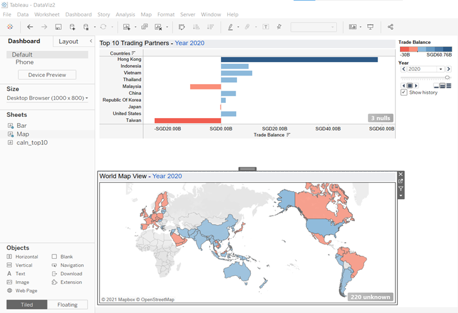   
Figure 4.3.1: Insert bar chart and map into dashboard

•	Next, format dashboard colour and fonts:

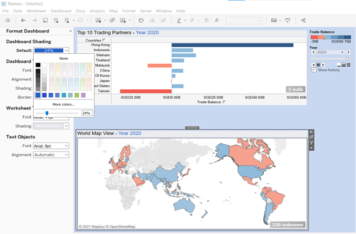   
Figure 4.3.2: Format dashboard and font colours

•	Thereafter, add the dashboard header:

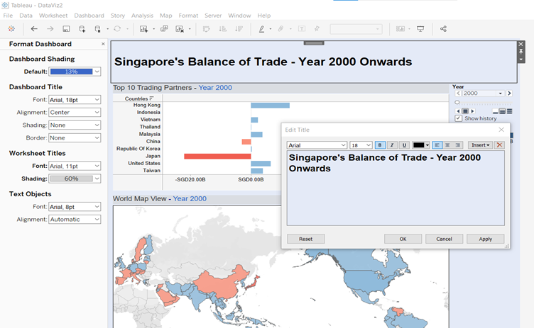   
Figure 4.3.3: Filter for the Top 10 countries

•	The completed dashboard is ready for publishing in Tableau Public:

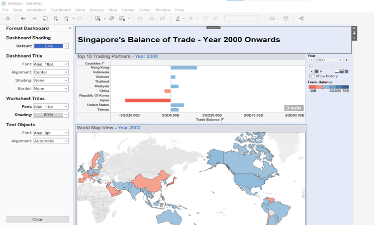   
Figure 4.3.4: Select upper (non-continuous) “Year” attribute for “Month-Year” in Columns field

# 5.0	Major Observations

Re-designed visualisation:

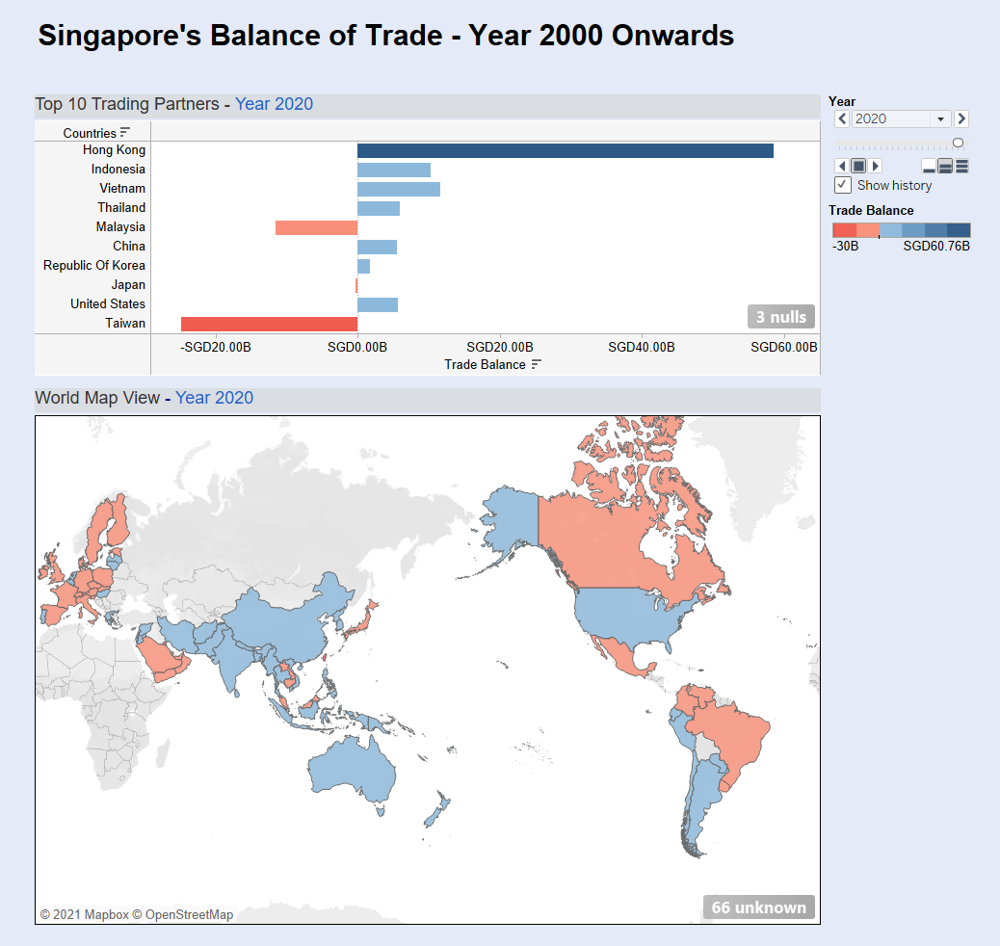   
Figure 5: Re-designed Visualisation

The major observations from re-designed visualisation are as follow:

(a)	Hong Kong is Singapore’s biggest net exporting market throughout the visualisation timeline from year 2000 to 2020, followed by Indonesia from 2003, and Vietnam from 2008.
  
(b)	From 2018, Taiwan overtook United States of America as Singapore’s biggest net importing market. United States had been Singapore biggest net importing market from 2008 to 2017.

(c)	Malaysia most recently became Singapore’s net importing market from 2019, and our trade deficit with Malaysia deteriorated in 2020 as exports to Malaysia fell during the COVID19 pandemic lockdown conditions in both countries.  On the other hand, China had been Singapore’s net exporting market since 2009 and through to 2020.  


~ End
